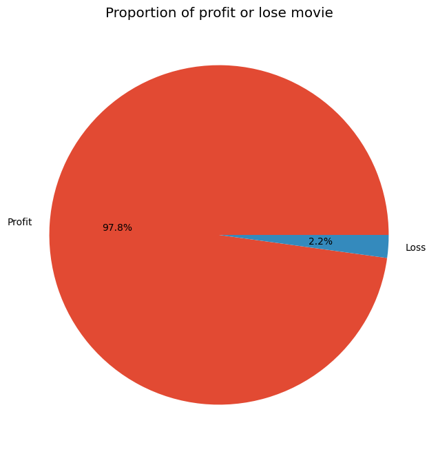

# EDA-Animation-Movies

## Overview
In this project, I used a dataset about animation movies that I obtained from Kaggle to get deep information by visualizing this data in Python using Matplotlib and Seaborn. The first step for this project is to load the CSV into Python, and then I formulated some questions to answer based on this data

## Analysis
Here are some questions that need further analysis
1. What animated movie has the longest runtime?
2. What is the correlation between revenue and budget?
3. Are all animated movie for children ?
4. What is the correlation between revenue and runtime?
5. Which year had the most animated movie releases?
6. Which animated movie is the most popular?
7. Which animated genre is produced the most?
8. Which country is the driving force behind global animation?
9. What language is used the most in animated film production?
10. Do all animated films make a profit?

## Result
### 1. What animated movie has the longest runtime?
  
On the chart bar above is shown an animated movie based on runtime, on the top three positions are Giant 600 Cartoon Collection, 200 Family Cartoons Collection Vol. 1, and 150 Cartoon Clasics. which is a collection of several cartoons from various studios and eras such as popeye, bety boop, woody woodpecker and others.

### 2. What is the correlation between revenue and budget?
  
in the scatter plot, the plot points tend to increase from left to right, this shows that there is a positive relationship between budget and reviews, meaning that the bigger the budget, the bigger the revenue. There are also several outliers that can be observed in the scatter plot, where there are films with high budgets but generating little revenue

### 3. Are all animated movie for children ?
  
Around 90% of the animation is made for children, and the remainder is not for children.

### 4. What is the correlation between revenue and runtime?
  
There is no relationship between Runtime and Revenue

### 5. Which year had the most animated movie releases?
  
Animated films produced over the last 20 years have seen an increase every year. with the highest increase in 2021, followed by 2020, 2022, 2019

### 6. Which animated movie is the most popular?
  
elemental is most popular among all the animated movie in the dataset

### 7. Which animated genre is produced the most?
  

### 8. Which country is the driving force behind global animation?
  
The chart shows that the country that produces the most animated films is the United States, and Japan is in second place.

### 9. What language is used the most in animated film production? 10. Do all animated films make a profit?
  
chart shows English is the most widely used language on movie with a total of 12,000 English-language movies, not expected that silent movie/no languange occupies the 2nd position with the total silent movie being 6000 movies

### 10. Do all animated films make a profit?
  
The pie chart showed that 97.8% of the films made a profit and the remaining 2.2% made a loss.

   

