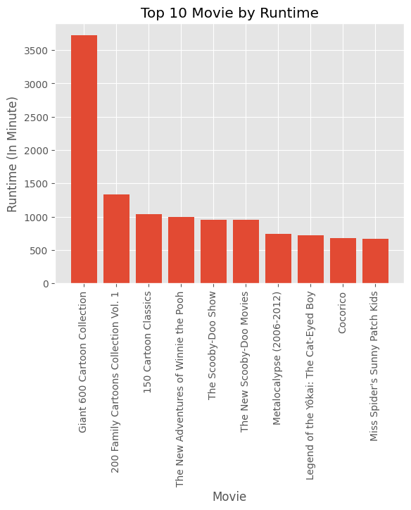
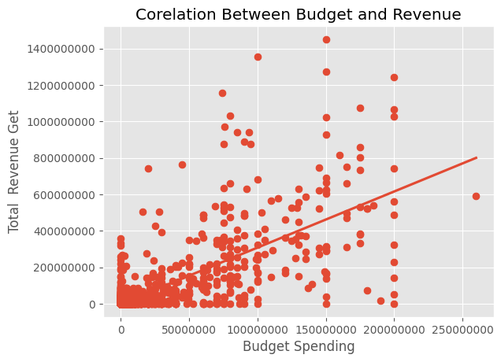
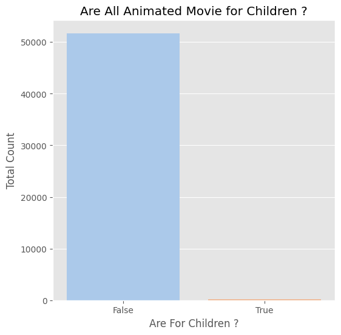
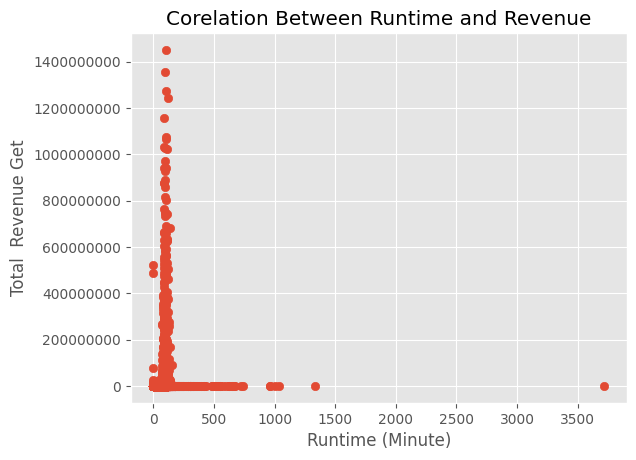
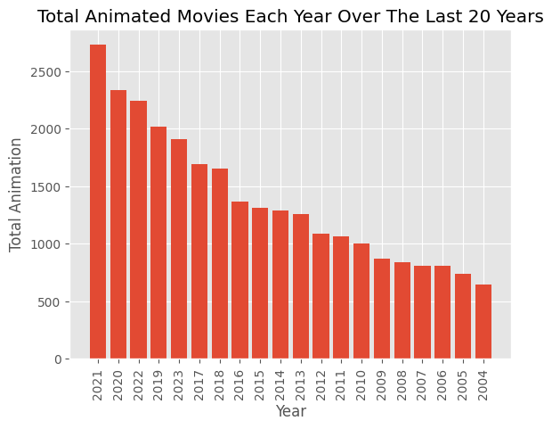
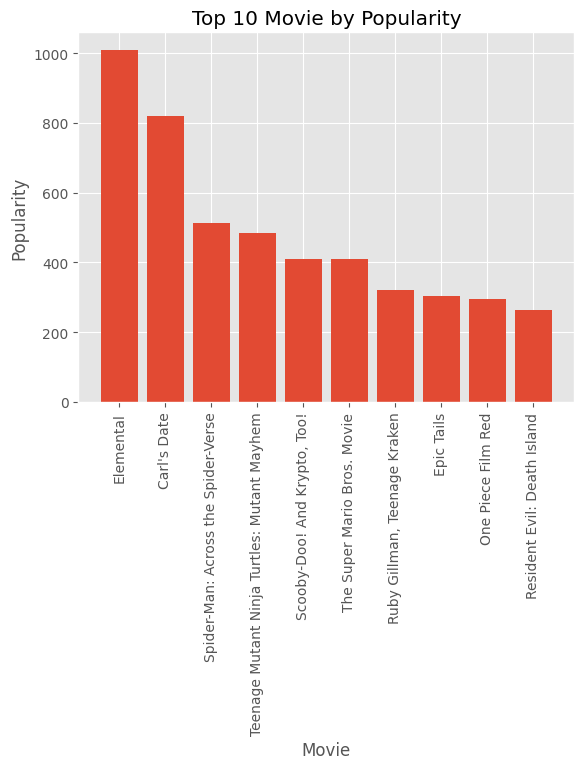
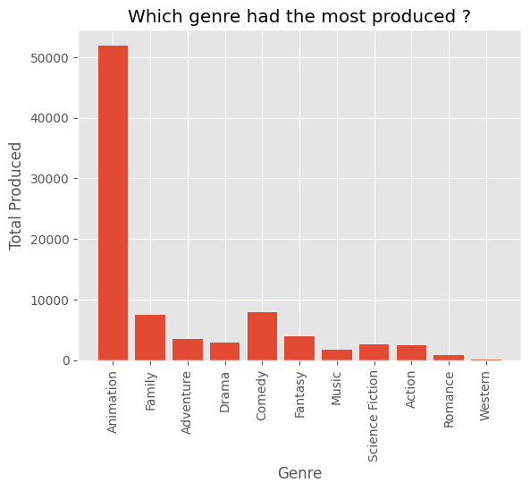
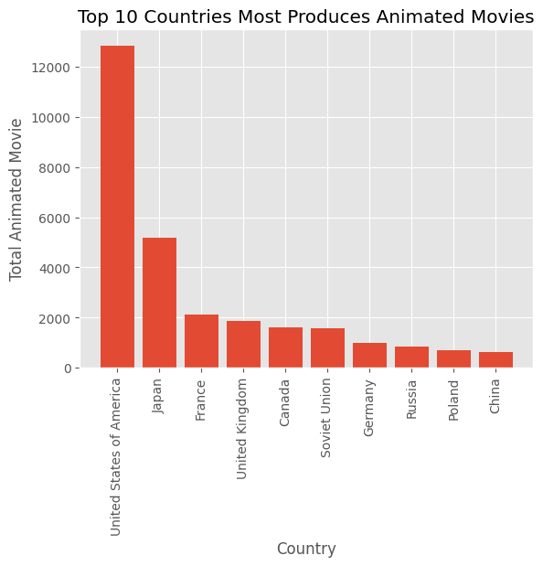
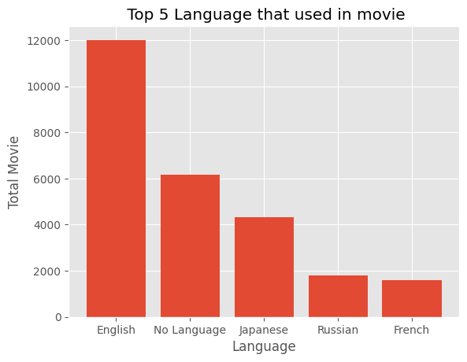

# EDA-Animation-Movies

## Project Overview
This project aims to explore the information contained in the dataset by creating visualizations for a clearer understanding. visualizations were created using the matplotlib and seaborn packages.

## Objectives
Here are some questions that need further analysis
1. What animated movie has the longest runtime?
2. What is the correlation between revenue and budget?
3. Are all animated movie for children ?
4. What is the correlation between revenue and runtime?
5. Which year had the most animated movie releases?
6. Which animated movie is the most popular?
7. Which animated genre is produced the most?
8. Which country is the driving force behind global animation?
9. What language is used the most in animated film production? 10. Do all animated films make a profit?

## Result
### 1. What animated movie has the longest runtime?
  
On the chart bar above is shown an animated movie based on runtime, on the top three positions are Giant 600 Cartoon Collection, 200 Family Cartoons Collection Vol. 1, and 150 Cartoon Clasics. which is a collection of several cartoons from various studios and eras such as popeye, bety boop, woody woodpecker and others.

### 2. What is the correlation between revenue and budget?

### 3. Are all animated movie for children ?

### 4. What is the correlation between revenue and runtime?

### 5. Which year had the most animated movie releases?

### 6. Which animated movie is the most popular?

### 7. Which animated genre is produced the most?

### 8. Which country is the driving force behind global animation?

### 9. What language is used the most in animated film production? 10. Do all animated films make a profit?

   

